# ANGULAR (WEEK-5, DAY-3)

After a good understanding of Node.js and React, we are introduced to the Angular concept.

## ANGULAR
Angular is an open-source front-end framework developed and maintained by Google. It is used to build dynamic applications. Angular is written in TypeScript and converts it into JavaScript later on. It follows a component-based architecture, which makes it easier to develop and maintain applications.

## Commands to Install Angular
- **sudo npm install -g @angular/cli**  
  Installs the Angular CLI package globally to create, build, and manage Angular projects.

- **sudo npm install -g npm@11.2.0**  
  Installing the latest version of Angular.

- **ng version**  
  Checking the version of Angular to ensure that Angular is installed.

- **ng new first-hello-world**  
  Creates the first Angular project with `first-hello-world`.

  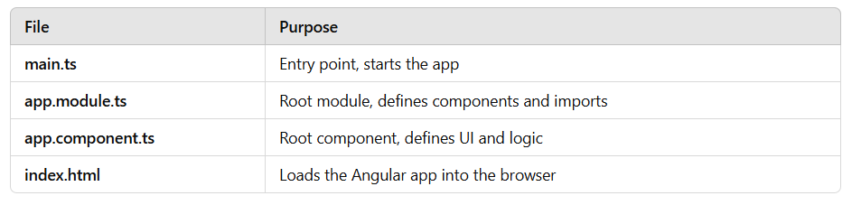

- **Now open the app and work on it.**

---

## Flow of Execution in Angular
- In this project, firstly, I tried without using CSS, only with an HTML file.  
- In this scenario, Angular works like this:
  1. Angular simply renders the HTML from `app.component.html` into the `index.html` file.
  2. The browser applies the default styles automatically.

### `app.component.html`
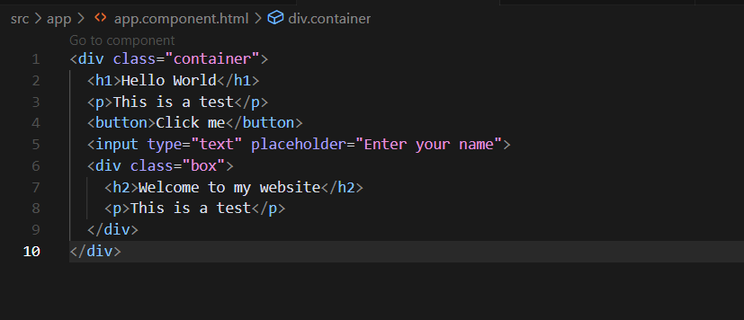
- To run these files, we need to use the command:
```bash
ng serve
```

### `app.component.css`
![Linux Commands]
- Added css

### `app.component.ts`
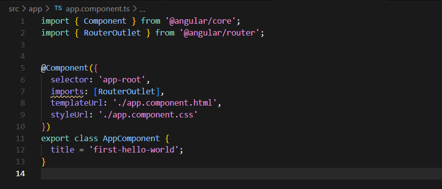
- This file defines the root component of the app.
- `@Component` tells Angular how to handle the component.
- `RouterOutlet` sets up the component to handle routing.

---

### `app.component.html`
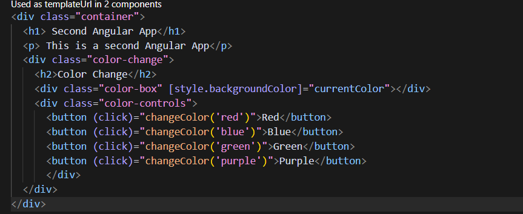
- In the HTML file, we are using a `div` tag where we are having the buttons with respective colors.  
- When we click on them, the color will be changed and displayed.

### `app.component.css`
- In the CSS file, we are styling our page with different colors, including the buttons and container.

### `app.component.ts`
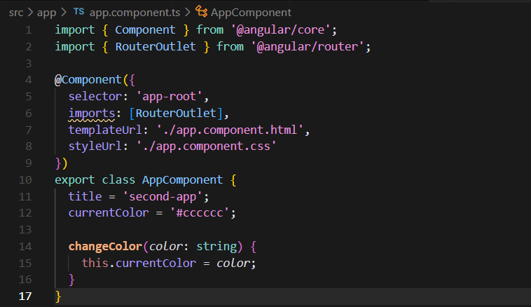
- In this file, we have changed the title of the app to `second-app`, and the color is the same.

---

## Routing in Angular
- Next, we worked on routing and switched the pages.
- Firstly, created the components using the command:
```bash
ng g c <comp-name>
```
- Here we have created three components: `home`, `about`, `contact`.

### `home.component.html`
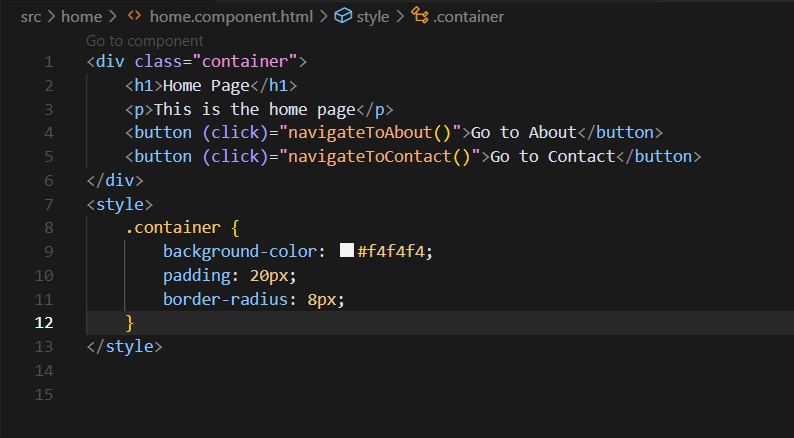

### `home.component.ts`
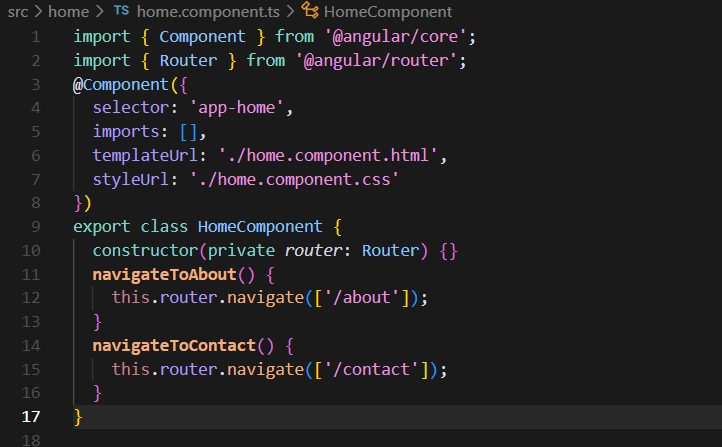
**Methods:**
- `navigateToAbout()` → Calls `this.router.navigate(['/about'])` to navigate to `/about`.
- `navigateToContact()` → Calls `this.router.navigate(['/contact'])` to navigate to `/contact`.

---

### `about.component.html`
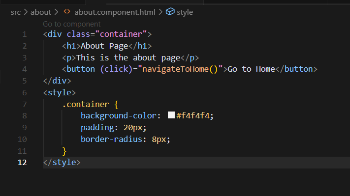

### `about.component.ts`
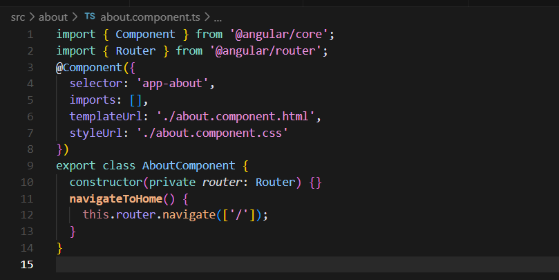
- In the about component, we have mentioned only to traverse back to home by using `navigateToHome` method.

---

### `contact.component.html`
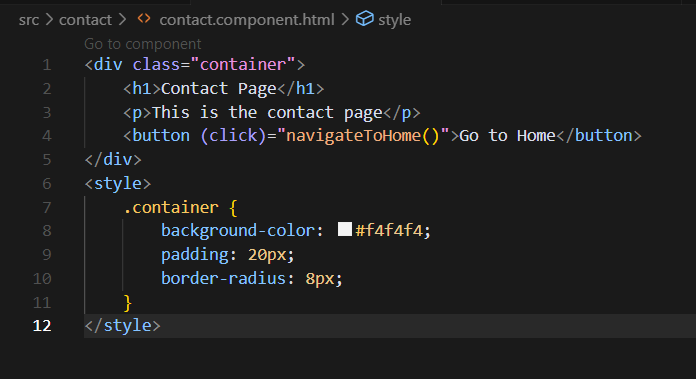

### `contact.component.ts`

- In the contact component, we have mentioned only to traverse back to home by using `navigateToHome` method.

---

## Main Files
- The main files where it renders all the components and navigates it:
  - **app.component.html** → Designs the page.
  - **app.routes.ts** → Routes the components by providing the routes.

### `app.component.html`
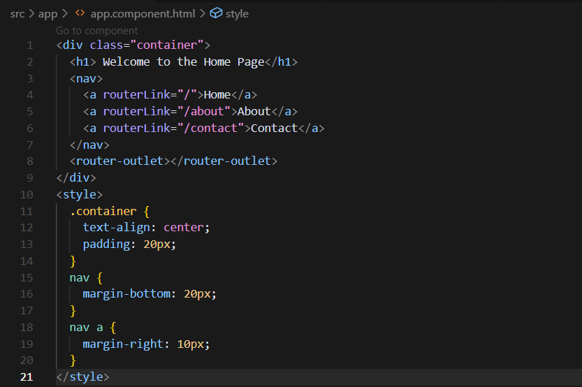
- In this, we have mentioned the components in a `nav` tag where it navigates to the pages.

### `app.routes.ts`
 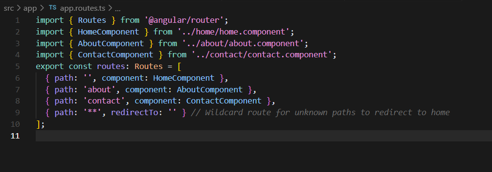
### Working of this:
1. The `RouterModule` creates an internal router tree based on the `routes[]`.
2. When a user navigates to a URL, Angular checks the router tree for a match.
3. If a match is found, Angular dynamically loads the corresponding component in the `RouterOutlet`.
4. If no match is found, Angular falls back to the wildcard route (`**`) and redirects to `/`.

---

